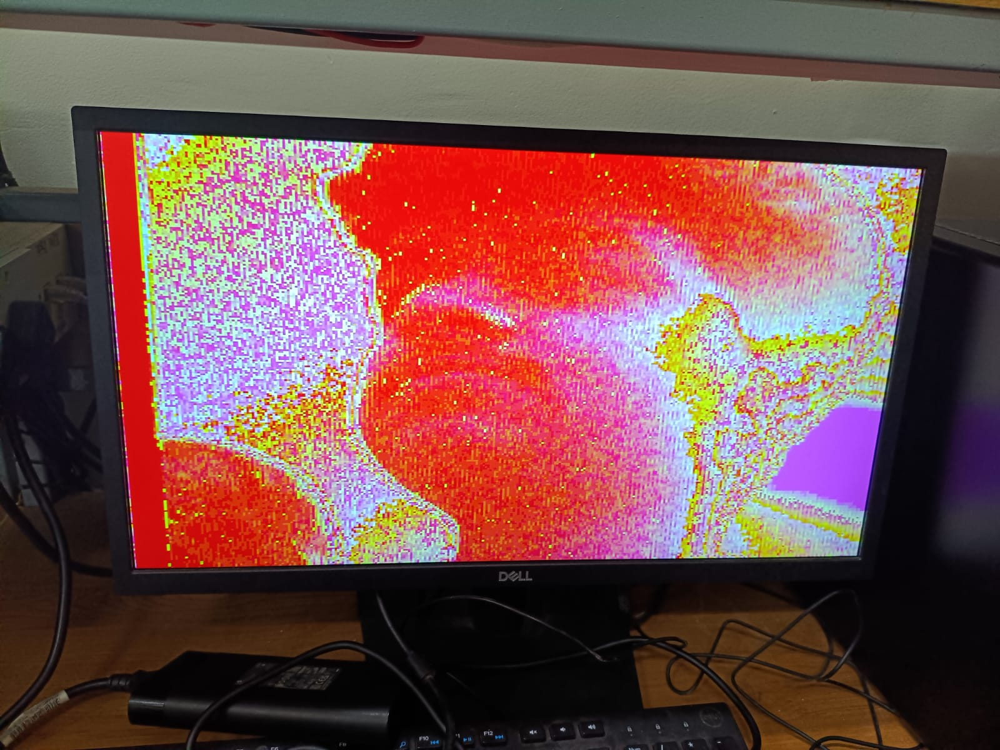
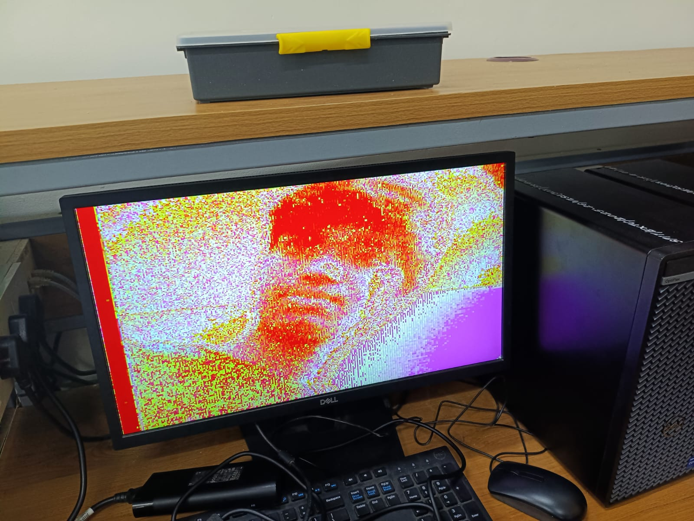

# FPGA-Based Surveillance Object Detection System using Verilog

A hardware-oriented real-time surveillance object detection system implemented on FPGA using Verilog HDL.  
The project focuses on efficient frame acquisition, memory-assisted image processing, and real-time object comparison for surveillance applications.

---

# Overview

This system implements a lightweight FPGA-based image processing pipeline capable of:

- Capturing image frames
- Performing object comparison
- Storing reference image data using BRAM
- Detecting new or previously encountered objects
- Displaying processed output through VGA

The design emphasizes hardware efficiency and real-time operation using FPGA architecture.

---
# Hardware Output

## VGA Output Demonstration

  

  

The images above show the real-time VGA output generated by the FPGA-based image processing pipeline during surveillance object detection and frame processing operations.

# Features

- Real-time frame acquisition
- BRAM-assisted memory access
- VGA output interface
- Hardware-based image comparison
- Self-updating image reference mechanism
- Modular Verilog architecture

---

# System Architecture

| Module | Function |
|---|---|
| `top.v` | Top-level integration module |
| `capture.v` | Frame acquisition and capture logic |
| `controller.v` | System control and coordination |
| `vga.v` | VGA display interface |
| `debounce.v` | Button debounce logic |

Additional IP cores:
- `blk_mem_gen_0.xci` → BRAM memory generation
- `clk_wiz_0.xci` → Clock generation and management

---

# Working Principle

1. Image frames are captured through the acquisition module.
2. Captured data is processed and compared against stored image references.
3. BRAM is used for high-speed image data storage and retrieval.
4. The controller coordinates comparison and update operations.
5. Processed output is displayed through the VGA interface.

The system can distinguish between previously stored images and newly encountered inputs with minimal computational overhead.

---

# Technologies Used

- Verilog HDL
- FPGA Architecture
- BRAM-Based Memory Systems
- VGA Display Interfacing
- Digital Hardware Design

---

# What I Learned

This project helped me develop practical understanding of:

- FPGA-based hardware design
- Verilog HDL development
- Real-time digital image processing
- BRAM memory interfacing
- VGA signal generation
- Hardware-efficient system architecture
- Modular RTL design and debugging

---

# Future Improvements

- Higher-resolution frame processing
- Hardware acceleration optimizations
- Edge detection and filtering modules

---

# Author

**Krrish Sanjay Khavnekar**

---
